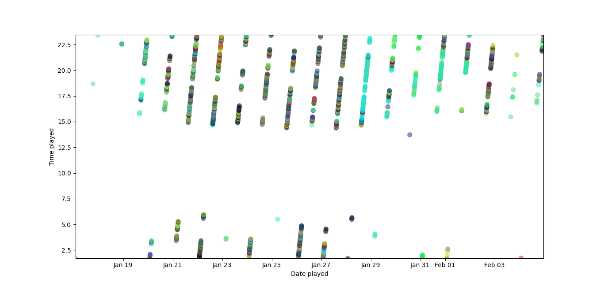
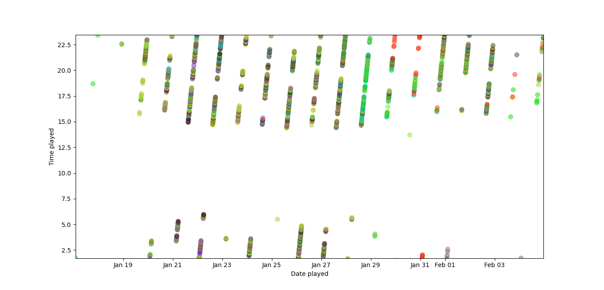

# Owning my Data

Python functions to analyze user data from Facebook, Google, and Spotify.

## Images

This graph displays the plays of every song that was played more than 100 times between Jan 2021 and Feb 2021.

The colors are randomly generated for each individual song. 

## Codebase

### spotify.py

This file runs a function that parses the json data from `StreamingHistory1.json` and collects the songs that were played more than 10 times over the last two months.

The time information for each of these plays is collected and visualized with Matplotlib in `spotify_graph.py`.

Each song is randomly assigned a color, and each dot represents a play. 

### facebook.py
